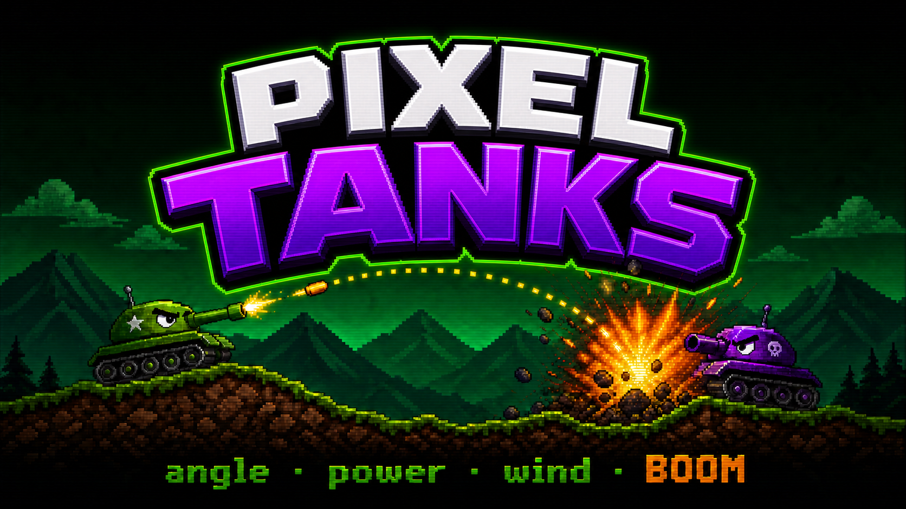

<div align="center">

# 🎮 PIXEL TANKS

**Танковая дуэль на Canvas. Ретро-пиксель. Один выстрел решает всё.**

[](https://pixeltanks.ru)

[](https://nextjs.org)
[](https://react.dev)
[](https://typescriptlang.org)
[](https://tailwindcss.com)
[](https://payloadcms.com)



_Два танка. Песчаные дюны. Ветер путает карты, а Терминатор никогда не промахивается дважды._

</div>

---

## ⚡ Что это

Аркадная артиллерийская дуэль в духе классических Scorched Earth / Worms: выставляешь **угол**, накачиваешь **мощность**, делаешь поправку на **ветер** — и сносишь противника вместе с куском ландшафта. Против тебя — бот **Terminator** с симуляцией прицеливания и скверным характером.

Родилась как дипломный проект команды **Atlanta Team** (Яндекс.Практикум, 2021). Сейчас переживает второе рождение: полный rewrite на современный стек — причём **код фаз пишет автономный агент** (Ralph Loop на Claude), а люди занимаются геймдизайном и ревью.

## 🕹️ Управление

| Ввод                        | Действие                                          |
| --------------------------- | ------------------------------------------------- |
| 🖱️ Мышь                     | угол прицела                                      |
| 🖱️ Колесо                   | мощность выстрела                                 |
| 🖱️ Клик / `Enter` / `Space` | **ОГОНЬ**                                         |
| `←` `→` `↑` `↓`             | точная настройка                                  |
| `Ctrl` + стрелки            | смена оружия · перемещение танка                  |
| 📱 Тач                      | «оттяни и отпусти» — как рогатка _(в разработке)_ |

## 🚀 Быстрый старт

```bash
git clone https://github.com/AtlantaTeam/pixel-tanks.git
cd pixel-tanks
npm install
cp .env.example .env.local   # заполнить PAYLOAD_SECRET
npm run dev                  # → http://localhost:3050
```

Полезное: `npm run test` · `npm run lint` · `npm run lint:fsd` · `npm run typecheck`

## 🌍 Прод

Живая игра — **[pixeltanks.ru](https://pixeltanks.ru)**. Деплой автоматический: каждый push в `main` запускает [`deploy.yml`](.github/workflows/deploy.yml), который собирает и катит на VDS. Прод-БД (SQLite) бэкапится по systemd-таймеру.

Детали инфраструктуры, отката и восстановления — в [`docs/deploy/`](docs/deploy/).

Игра в активном переносе со старого стека: часть возможностей ещё в работе, см. роадмап ниже.

## 🧱 Под капотом

- **Next.js 16 + React 19** — App Router, серверные компоненты, React Compiler
- **Canvas-движок** — детерминированная физика (seed → одинаковый бой), `requestAnimationFrame` с delta time, offscreen-слои террейна
- **FSD 2.1** — слои `app → views → widgets → features → entities → shared`, валидируется Steiger
- **Payload CMS 3 + SQLite/Postgres** — юзеры, очки, лидерборд, Drizzle под капотом
- **Своя UI-тема** — Press Start 2P, NES-рамки, палитра Pico-8
- **Vitest + Playwright** — unit-тесты физики и e2e игровой петли

## 🗺️ Роадмап

Идём по [PRD game-next](docs/game-next/prd.md) — 9 фаз на [доске проекта](https://github.com/orgs/AtlantaTeam/projects/1):

**сид-физика** → **мобильный layout** → **тач-рогатка** → **клавиатура** → **оригинальный саунд** 🎵 → **juice** (частицы, shake, slow-mo) → **реплики Терминатора** 🤖 → **бой дня** → **реплеи-ссылки**

Дальше: auth + профиль → лидерборд → Яндекс ID → i18n.

## 🤝 Команда

**Atlanta Team** — дипломный проект 2021 → next-gen rewrite 2026.
Разработка: автономные агентные циклы + человеческое ревью. Issues и milestones — в [бэклоге](https://github.com/AtlantaTeam/pixel-tanks/issues).

<div align="center">

_Сделано с 💛 и небольшим количеством `Math.random()` — теперь уже инжектируемого._

</div>
